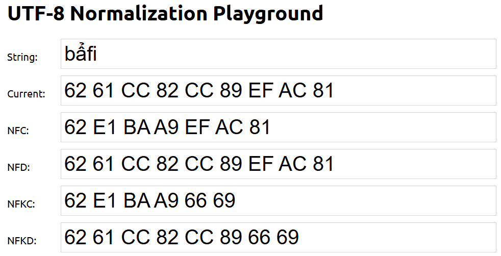

# UTF-8 Normalization Playground

This is a very basic, vanilla JavaScript, html and css project that allows you to play with UTF-8 normalization. It uses the `String.prototype.normalize` method to present the normalized form of a string in NFC, NFD, NFKC and NFKD forms.

It also use [iconv-lite](https://github.com/ashtuchkin/iconv-lite) packed with [esbuild](https://esbuild.github.io/) to convert to and from non-UTF-8 encodings.

You can try it out at https://kpym.github.io/utf8playground.

